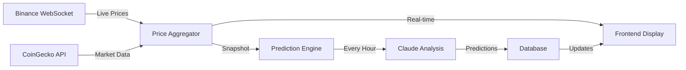

# Crypto Vision - Production-Ready AI Crypto Prediction Platform
## Final PRD v2.0

### 🎯 Vision
Build a production-ready crypto prediction platform that combines real-time market data with Claude's analytical capabilities to deliver accurate, explainable weekly/monthly forecasts that users will pay for.

## 1. Optimal Prediction Strategy

### The Hybrid Approach: Claude + Context
```typescript
// Feed Claude objective data, let it make subjective decisions
interface MarketContext {
  // Real-time data
  currentPrice: number;
  volume24h: number;
  priceChange24h: number;
  
  // Technical indicators (calculated, not interpreted)
  rsi: number;
  macd: { signal: number; histogram: number };
  bollingerBands: { upper: number; lower: number };
  volumeProfile: number[];
  
  // Market context
  fearGreedIndex: number;
  btcDominance: number;
  totalMarketCap: number;
  
  // News & sentiment
  recentHeadlines: string[];
  socialMentions: number;
  whaleActivity: { buys: number; sells: number };
}

// Claude interprets ALL data holistically
interface ClaudePrediction {
  sevenDayTarget: number;
  thirtyDayTarget: number;
  confidence: number; // 0-100
  direction: 'strong_buy' | 'buy' | 'neutral' | 'sell' | 'strong_sell';
  keyFactors: string[]; // What's driving the prediction
  riskAssessment: string;
  technicalSummary: string; // Claude's interpretation of indicators
  fundamentalSummary: string;
  contraryFactors: string[]; // What could invalidate prediction
}
```

### Why This Is Optimal:
1. **Claude gets full context** but makes the final call
2. **Technical indicators provide objective anchors** for analysis
3. **Users get both data AND interpretation**
4. **Testable and auditable** predictions

## 2. Real-Time Architecture

### Data Flow Design


### Update Strategy
- **Prices**: Real-time via WebSocket (free, unlimited)
- **Predictions**: Hourly for free users, 15-min for premium
- **Alerts**: Instant when thresholds crossed
- **News**: Every 30 minutes

### Implementation
```typescript
// Real-time price updates
const useCryptoPrice = (symbol: string) => {
  const [price, setPrice] = useState<number>();
  
  useEffect(() => {
    const ws = new WebSocket(`wss://stream.binance.com:9443/ws/${symbol}@trade`);
    ws.onmessage = (event) => {
      const data = JSON.parse(event.data);
      setPrice(parseFloat(data.p));
    };
    return () => ws.close();
  }, [symbol]);
  
  return price;
};
```

## 3. Monetization Strategy

### Pricing Tiers
```yaml
Free Tier:
  - Top 10 cryptocurrencies
  - Hourly prediction updates
  - 7-day forecasts only
  - 5 email alerts/month
  - Basic technical data

Pro Tier ($19/month):
  - Top 50 cryptocurrencies
  - 15-minute prediction updates
  - 7 & 30-day forecasts
  - 50 alerts/month (email + SMS)
  - Advanced indicators
  - CSV export

Premium Tier ($49/month):
  - All cryptocurrencies (200+)
  - 5-minute prediction updates
  - Custom timeframe forecasts
  - Unlimited alerts
  - API access
  - Webhook integrations
  - Priority support
  - Auto-trading beta access
```

### Revenue Projections
- 10,000 users → 5% convert to Pro = $9,500/month
- 1% convert to Premium = $4,900/month
- Total: $14,400/month (achievable in 6 months)

## 4. Production-Ready Tech Stack

### Core Stack
```typescript
// Frontend
- Next.js 14 (App Router) - SEO + Performance
- TypeScript - Type safety for financial data
- Tailwind CSS + Tremor - Financial charts
- Zustand - State management
- React Query - Data synchronization
- Vercel - Edge deployment

// Backend  
- Next.js API Routes - Serverless scalability
- Anthropic Claude API - Core predictions
- PostgreSQL (Neon) - Serverless, branches for testing
- Redis (Upstash) - Distributed caching
- Temporal - Workflow orchestration
- DataDog - Monitoring

// Data Sources
- Binance WebSocket - Real-time prices
- CoinGecko API - Historical data
- CryptoCompare - News aggregation
- Alternative.me - Fear & Greed Index
- Glassnode (future) - On-chain metrics
```

### Why These Choices:
1. **Neon > Supabase**: Better for financial data, ACID compliance
2. **Temporal**: Ensures prediction workflows complete even if crashed
3. **DataDog**: Critical for monitoring prediction accuracy
4. **Tremor**: Built for financial dashboards

## 5. Key Features Priority

### Phase 1: MVP (Week 1-2)
- [ ] Real-time price display (top 10 coins)
- [ ] Hourly Claude predictions
- [ ] 7-day forecast charts
- [ ] Email alerts
- [ ] Basic auth (NextAuth)
- [ ] Mobile responsive

### Phase 2: Premium Features (Week 3-4)
- [ ] 30-day forecasts
- [ ] Top 50 coins
- [ ] SMS alerts (Twilio)
- [ ] Historical accuracy tracking
- [ ] API access
- [ ] Advanced charts

### Phase 3: Scale (Month 2)
- [ ] All coins (200+)
- [ ] Custom indicators
- [ ] Webhook integrations
- [ ] Auto-trading beta
- [ ] Affiliate program
- [ ] White-label options

## 6. Testing Strategy (CRITICAL)

### Test Requirements
```typescript
// Mandatory coverage thresholds
{
  "jest": {
    "coverageThreshold": {
      "global": {
        "branches": 90,
        "functions": 90,
        "lines": 95,
        "statements": 95
      }
    }
  }
}
```

### Test Categories
1. **Unit Tests** (95% coverage)
   - All utility functions
   - API route handlers
   - Data transformations
   - Claude prompt builders

2. **Integration Tests**
   - API endpoints
   - WebSocket connections
   - Database operations
   - Cache invalidation

3. **E2E Tests** (Playwright)
   - User registration flow
   - Prediction viewing
   - Alert creation
   - Payment flow

4. **Performance Tests**
   - <100ms price updates
   - <2s prediction generation
   - 10k concurrent WebSockets

## 7. Claude Integration Details

### Prompt Engineering
```typescript
const generatePredictionPrompt = (context: MarketContext): string => {
  return `
    Analyze ${context.symbol} with the following data:
    
    Current Price: $${context.currentPrice}
    24h Change: ${context.priceChange24h}%
    RSI: ${context.rsi}
    MACD Histogram: ${context.macd.histogram}
    
    Market Context:
    - Fear & Greed: ${context.fearGreedIndex}/100
    - BTC Dominance: ${context.btcDominance}%
    - Recent News: ${context.recentHeadlines.join(', ')}
    
    Provide a 7-day and 30-day price prediction with:
    1. Specific price targets
    2. Confidence level (0-100)
    3. Top 3 factors influencing your prediction
    4. Main risk that could invalidate this prediction
    
    Be specific and data-driven. Format as JSON.
  `;
};
```

### Cost Optimization
- Cache predictions for 1 hour minimum
- Batch similar requests
- Use Claude Haiku for simple queries
- Opus only for complex analysis

## 8. Monitoring & Success Metrics

### Prediction Accuracy Tracking
```sql
-- Track every prediction
CREATE TABLE predictions (
  id UUID PRIMARY KEY,
  coin_symbol VARCHAR(10),
  predicted_at TIMESTAMP,
  target_date TIMESTAMP,
  predicted_price DECIMAL(20,8),
  actual_price DECIMAL(20,8),
  confidence INTEGER,
  accuracy_score DECIMAL(5,2)
);

-- Daily accuracy report
SELECT 
  DATE(target_date) as date,
  AVG(accuracy_score) as avg_accuracy,
  COUNT(*) as total_predictions
FROM predictions
WHERE actual_price IS NOT NULL
GROUP BY DATE(target_date);
```

### KPIs to Track
- Prediction accuracy (target: >65%)
- User retention (target: >40% at 30 days)
- Revenue per user (target: $2.50)
- API latency (target: <300ms p95)
- Alert click rate (target: >30%)

## 9. Security & Compliance

### Security Measures
- API keys encrypted with AES-256
- Rate limiting per user/IP
- HTTPS everywhere
- CSP headers
- SQL injection protection
- XSS prevention

### Compliance
- Clear disclaimers (not financial advice)
- Terms of service
- Privacy policy (GDPR compliant)
- No guarantee of profits
- Risk warnings prominent

## 10. Agent Workflow Improvements

### Enforced Rules
```yaml
architect_agent:
  must_include:
    - Test specifications for EVERY feature
    - Performance benchmarks
    - Security requirements
  
builder_agent:
  workflow:
    - Write failing test first
    - Implement feature
    - Test must pass
    - Coverage must be >95%
    - Then commit
  
validator_agent:
  checks:
    - No commit without tests
    - Coverage reports every hour
    - Performance benchmarks met
    - Security scan passed
```

### Monitoring Dashboard Updates
Show in real-time:
- Current test coverage %
- Tests written in last hour
- Failed test count
- Time since last test written
- Validator interventions

## 11. Launch Checklist

### Pre-Launch Requirements
- [ ] 95% test coverage achieved
- [ ] Load tested to 10k users
- [ ] Security audit passed
- [ ] Legal disclaimers added
- [ ] Payment system tested
- [ ] Monitoring dashboard live
- [ ] Incident response plan
- [ ] Customer support ready

### Go-Live Plan
1. Soft launch to 100 beta users
2. Gather feedback for 1 week
3. Fix critical issues
4. Public launch with ProductHunt
5. Scale marketing based on accuracy

## 12. Future Roadmap

### Project4 Integration
Once Crypto Vision succeeds, we'll build the full trading platform:
- Direct trading execution
- Portfolio management
- DeFi integration
- Staking rewards tracking
- Tax reporting
- Social trading features

### Why This Sets Up Project4
- Proven prediction accuracy
- Established user base
- Trust in our AI
- Revenue to fund development
- Technical infrastructure ready

---

## Summary: Why This Will Succeed

1. **Claude's Edge**: Better analysis than pure technical indicators
2. **Real Value**: Accurate predictions users will pay for
3. **Clear Monetization**: Obvious upgrade path
4. **Production Ready**: Built to scale from day 1
5. **Test Driven**: Quality guaranteed through testing

Ready to create the test-first agent instructions and launch? 🚀