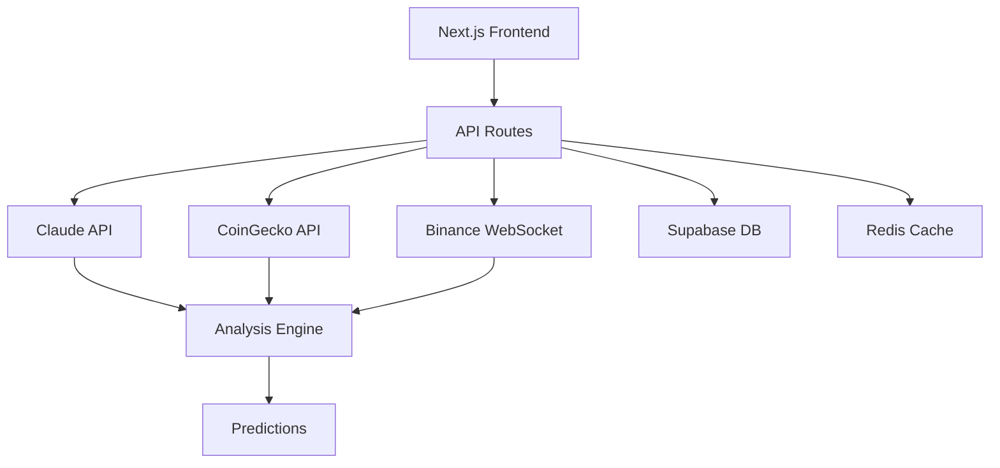

# Crypto Vision - AI-Powered Crypto Forecasting Dashboard
## PRD DRAFT v1.0 - FOR DISCUSSION

### Executive Summary
A lightweight, Claude-powered cryptocurrency analysis dashboard that provides 7-day price predictions and market insights. This MVP focuses on demonstrating AI integration and real-time data processing while serving as a testbed for our enhanced agent workflow.

## 1. Simplified Scope for Project3

### Core Features (MVP)
1. **Dashboard View**
   - Top 20 cryptocurrencies by market cap
   - Real-time prices via WebSocket
   - 7-day AI prediction (up/down/neutral)
   - Confidence percentage

2. **AI Analysis Engine**
   - Claude-powered market analysis
   - Technical indicator interpretation
   - Sentiment analysis from news
   - Simple buy/hold/sell signals

3. **Detail View**
   - Price chart with prediction overlay
   - AI-generated market analysis
   - Key technical indicators
   - Recent news sentiment

4. **Alerts (Basic)**
   - Email notifications only for MVP
   - Price threshold alerts
   - AI signal changes

## 2. Technical Stack Recommendations

### Frontend
```typescript
// Recommended Stack
- Next.js 14 (App Router)
- TypeScript (strict mode)
- Tailwind CSS + shadcn/ui
- Recharts for visualizations
- React Query for data fetching
- Vercel AI SDK (for Claude integration)
```

### Backend
```typescript
// API & Services
- Next.js API Routes (serverless)
- Anthropic Claude API (via Vercel AI SDK)
- CoinGecko API (free tier sufficient)
- Binance WebSocket (real-time prices)
- PostgreSQL (Supabase) for user data
- Redis (Upstash) for caching
```

### AI/ML Approach (Simplified)
```typescript
// Instead of complex ML models, leverage Claude for analysis
interface MarketAnalysis {
  prediction: 'bullish' | 'bearish' | 'neutral';
  confidence: number; // 0-100
  reasoning: string;
  keyFactors: string[];
  riskLevel: 'low' | 'medium' | 'high';
}
```

## 3. API Selection & Rationale

### Primary Data Sources
1. **CoinGecko API** (Free Tier)
   - 50 calls/minute
   - Historical data
   - Market data
   - Perfect for MVP

2. **Binance WebSocket** (Free)
   - Real-time price updates
   - No rate limits
   - Best liquidity data

3. **NewsAPI.io** (Crypto News)
   - 500 requests/day free
   - Sentiment analysis input
   - Major crypto publications

### Why Not Others?
- **Glassnode/Nansen**: Too expensive for MVP ($500+/month)
- **Twitter API**: Rate limits too restrictive
- **CryptoCompare**: Less reliable than CoinGecko

## 4. Simplified Architecture



## 5. Key Differentiators for MVP

1. **Claude-Powered Insights**
   - Natural language explanations
   - Context-aware analysis
   - No black-box ML models

2. **Real-Time + Predictive**
   - Live price updates
   - 7-day forecasts
   - Instant AI analysis

3. **Explainable AI**
   - Clear reasoning for predictions
   - Beginner-friendly explanations
   - Technical + fundamental analysis

## 6. Development Phases

### Phase 1: Foundation (Week 1)
- [ ] Project setup with testing framework
- [ ] API integrations (CoinGecko, Binance)
- [ ] Basic dashboard UI
- [ ] Claude integration setup

### Phase 2: AI Engine (Week 2)
- [ ] Prediction algorithm with Claude
- [ ] Technical indicator analysis
- [ ] News sentiment integration
- [ ] Confidence scoring

### Phase 3: User Features (Week 3)
- [ ] User authentication (Supabase)
- [ ] Alert system
- [ ] Portfolio tracking
- [ ] Historical predictions

## 7. Testing Requirements (MANDATORY)

### Test Coverage Goals
- Unit Tests: 95% coverage
- Integration Tests: All API endpoints
- E2E Tests: Critical user flows
- Performance Tests: <300ms response time

### Test-First Development
```typescript
// Example test-first approach
describe('PricePredictor', () => {
  it('should return prediction with confidence', async () => {
    const result = await predictor.analyze('BTC', marketData);
    expect(result).toHaveProperty('prediction');
    expect(result.confidence).toBeGreaterThan(0);
  });
});
```

## 8. Monitoring & Analytics

### Key Metrics
- Prediction accuracy (tracked daily)
- API latency (p50, p95, p99)
- User engagement (DAU, retention)
- Alert accuracy (clicked vs ignored)

### Agent Performance Metrics
- Test coverage per commit
- Time to first test
- Code quality scores
- Documentation completeness

## 9. Cost Estimation

### Monthly Costs (1000 users)
- Vercel Hosting: $20
- Supabase: $25
- Redis (Upstash): $10
- Claude API: ~$50 (depending on usage)
- Total: ~$105/month

### Free Tier Limits
- CoinGecko: 50 calls/min (sufficient)
- Binance: Unlimited WebSocket
- NewsAPI: 500/day (need caching)

## 10. Questions for Discussion

1. **Prediction Approach**: Should we use Claude exclusively or add simple technical indicators?
2. **Coin Coverage**: Start with top 10 or top 20?
3. **Update Frequency**: Hourly predictions or real-time?
4. **Monetization**: Free with limits or freemium from start?
5. **Mobile**: Progressive Web App or native later?

## 11. Success Criteria

### Technical Success
- [ ] 95% test coverage achieved
- [ ] <300ms API response time
- [ ] 99.9% uptime
- [ ] Zero security vulnerabilities

### Product Success
- [ ] 60%+ prediction accuracy
- [ ] 40%+ 7-day retention
- [ ] 4.0+ app store rating
- [ ] 1000+ active users in month 1

## 12. Agent Workflow Requirements

### Architect Agent
- Must include test specifications in design
- Define test frameworks upfront
- Specify coverage requirements

### Builder Agent
- Write tests BEFORE implementation
- Cannot commit without tests
- Must achieve 95% coverage

### Validator Agent
- Block all untested code
- Run coverage reports hourly
- Enforce quality gates

---

## Next Steps
1. Finalize technical decisions
2. Create detailed test plan
3. Set up monitoring dashboard
4. Initialize project with test framework
5. Begin test-driven development

What aspects should we refine before launching the agents?